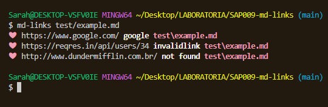
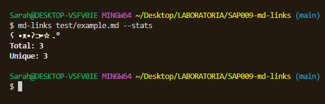
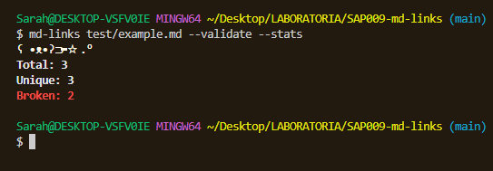

# Markdown Links

* [1. Sobre o MdLinks](#1-sobre-o-mdlinks)
* [2. Backlog](#2-backlog)
* [3. Instalação](#3-instalação)
* [4. Utilização](#4-utilização)


## 1. Sobre o MdLinks

4° projeto da SAP009 da Laboratoria, MdLinks é uma ferramenta de linha de comando (CLI) com a sua própria biblioteca (library) em JavaScript, criada a partir do Node.js, que analisa links em arquivos markdown ('.md') e devolve ao usuário características sobre eles.

## 2. Backlog

Antes de começar a desenvolver a biblioteca, foi criado um fluxograma para planejar a implementação de todas as partes do projeto.


Para o planejamento do projeto foi utilizado o Github Projects, com a criação de issues para as metas de cada entregável.

## 3. Instalação

Adicione um arquivo .npmrc ao seu projeto e informe o registry:

```
@s2arahrv:registry=https://npm.pkg.github.com
```

Rode o comando no terminal do seu projeto:

| Comando | npm i @s2arahrv/md-links |
|---------|-----------------------------|

## 4. Utilização

| Comando | md-links rota/do/arquivo.md (absoluta ou relativa) |
|---------|----------------------------------------------------|



---

| Comando | md-links rota/do/arquivo.md --validate |
|---------|----------------------------------------|


---

| Comando | md-links rota/do/arquivo.md --stats |
|---------|-------------------------------------|



---

| Comando | md-links rota/do/arquivo.md --validate --stats (ou --stats --validate) |
|---------|------------------------------------------------------------------------|



---

Caso digitado um comando inválido, md-links retorna uma mensagem de ajuda com todos os comandos válidos:


